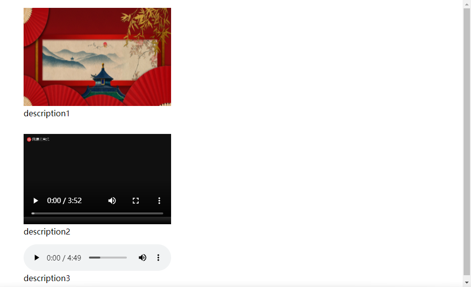
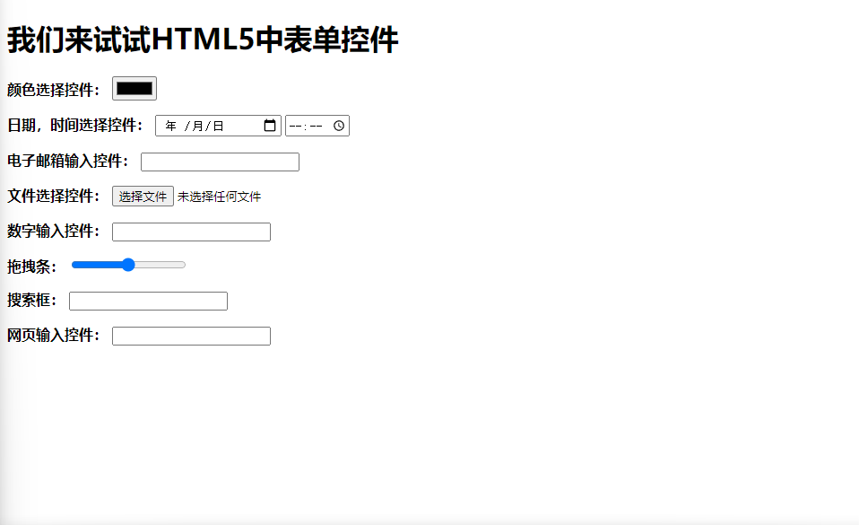

# 1.前端开发主要技术介绍

## 1.1.HTML5

**搭建网页结构的语言，增加了很多移动端的支持，简单好学。**

## 1.2.CSS3

**样式表，美化网页的语言，增加了很多动画、过渡等新特性，要记的英语单词非常多，不过非常有意思。**

## 1.3.JavaScript

**前端开发工程师最重要的“看家语言”，JS功底的好坏决定了职业高度，学习需要下苦功。**

## 1.4.Vne.js/React.js

**从2016年开始流行的前端框架，采用模块化开发，数据驱动，声明式编程。**


# 2.什么是IDE

**IDE是指集成开发环境，是含代码变价、关键字高亮、智能感应、只能纠错、格式美化、版本管理等功能于一身的“高级代码编辑器”。**

|        IDE名称         |      公司      |
| :--------------------: | :------------: |
| **Visual Studio Code** |  **微软公司**  |
|      **Sublime**       | **个人开发者** |
|        **Atom**        |   **GitHub**   |
|      **WebStorm**      | **Jet brains** |
|      **HBuidler**      |   **DCloud**   |


# 3.互联网基本原理

## 3.1.在本地开发，在服务器共享

**在本地把诸如.html / .css / .js文件全部写好，然后将这些文件上传到某一个服务器上，此时这个文件就拥有了网址：www.name.com/file/filename.html, 然后所有用户都能访问这个网址。**

## 3.2.HTTP协议

**定义：HTTP协议（<u>H</u>yper<u>t</u>ext <u>T</u>ransfer <u>P</u>rotocol，超文本传输协议）是互联网数据传输的常见协议。一次HTTP事务是由“HTTP请求”和“HTTP响应”构成。网址前的http:// 就表示用http协议请求页面。**

**用户通过输入网址访问一个网站，需要用户向服务器发出一个HTTP请求，服务器会正确识别用户所发来的HTTP请求，分析出正确的文件夹中的文件。**

**服务器接收到HTTP请求后，后向用户做出一个HTTP响应，让用户看到文件夹里的内容。**

## 3.3.什么是前端，什么是后端

**用户和服务器的流程：**

1. **用户向服务器发出HTTP请求。**
2. **在服务器上，Java、PHP、Python等程序将运行，执行数据库“增删查改”等业务，它们就是后端语言。**
3. **服务器向用户做出HTTP响应。**
4. **在浏览器中，HTML、CSS和JS程序将运行，执行页面结构渲染、美化、交互效果等业务，他们就是前端语言。**


# 4.创建第一个网页

##  4.1.文件创建方法

**方法一：先新建一个文件夹，然后把文件夹拖入 VS code 或者选择进 VS code ，然后新建（<u>ctrl+n</u>）一个新的.html文件。**

**方法二：先创建一个文件夹，在文件夹中直接点击鼠标右键“新建文本文档”，然后将后缀 .txt 改成 .html。** 

## 4.2.HTML骨架的生成

**输入 ! （英文模式下的感叹号），按下tab键，即可自动生成HTML5的骨架。**


# 5.浏览网页的方法

**方法一：直接双击文件夹中双击网页图标，即可查看网页。**

**方法二：给 VS code 安装Live Server插件，让网页实时更新，安装完成后按CTRL+shift+p，选择“open with live server”即可，使用这个方法之前需要把网页放在一个文件夹里（即第一种文件创建方式），且 VS Code 已经打开了这个文件夹。**


# 6.认识HTML5骨架

## 6.1.基本框架

```html
<!DOCTYPE html>
<html lang="en">
<head>
    <meta charset="UTF-8">
    <meta http-equiv="X-UA-Compatible" content="IE=edge">
    <meta name="viewport" content="width=device-width, initial-scale=1.0">
    <title>Document</title>
</head>
<body>
    
</body>
</html>
```

## 6.2.分块分析

### 6.2.1.W3C组织

**该组织是万维网的主要国际标准组织，负责制定Web标准，主要是HTML和CSS。**

### 6.2.2.文档类型声明DTD

```html
<!DOCTYPE html>	
```

**HTML文件第一行必须是DTD（Document Type Definition，文档类型声明**

**不写DTD会引起浏览器的一些兼容问题**

### 6.2.3.\<html>标签对

```html
<html lang="en">
</html>
```

**lang属性表示网页的语言，en 表示英文，zh 表示中文，学习期间改不改没所谓**

### 6.2.4.\<head>和\<body>

```html
<head>
    <meta charset="UTF-8">
    <meta http-equiv="X-UA-Compatible" content="IE=edge">
    <meta name="viewport" content="width=device-width, initial-scale=1.0">
    <title>Document</title>
</head>
<body>
    
</body>
```

**\<head>标签对是网页的配置，并不是网页的头部**

**\<body>标签对是书写网页的内容，包括网页的头部，主要内容，页脚等各个部分**


# 7.字符集

## 7.1.字符编码方式

```html
<meta charset="UTF-8">
```

**meta表示‘元标签’，charset表示’字符集‘，UTF-8表示’字符编码方式‘**

```html
<meta charset="gb2312">
```

**gb2312表示’字符编码方式‘，也称gbk，其中收录了所有的汉字字符（繁体和简体）和英语，少量韩文，日文和少量的图形字符，编写出来的网页比utf-8编写出来的网页所占空间少。**

## 7.2.更改字符编码方式

**无论使用哪种字符集，一定要在VS Code编辑器中将文件也设置为相同字符集，否则会出现乱码，然后更改meta标签，但是要注意，live server插件仅支持utf-8。**


# 8.title、关键字以及页面描述

## 8.1.title设置出现的位置

```html
<head>
    <meta charset="UTF-8">
    <meta http-equiv="X-UA-Compatible" content="IE=edge">
    <!--网页的视口设置-->
    <meta name="viewport" content="width=device-width, initial-scale=1.0">
    <!--网页关键词和页面描述-->
    <title>Document</title>		<!--这里这里-->
</head>
```

**网页的标题在title标签中插入，此时插入后的效果如下：**


**title标签会以文字的形式出现在网页名字上**

## 8.2.网页关键词和页面描述

**合理设置网页的管检测和页面描述，也是SEO（搜索引擎优化）的重要手段，目的是拉高有关搜索引擎中的自然排名。**

**使用meta标签设置网页关键词和描述，name属性非常关键，用来设置meta的具体功能。**

**meta属性中的name/content的属性可以重复设置。**

**如下俩个例子：**

```html
<meta name="Keywords" content="keywords1，keywords2……">
<!--这里是一个关键词属性，有利于网络引擎的爬取-->
```

```html
<meta name="Description" content="des1,des2……">
<!--这里是一个描述属性，能显示在网页搜索页面的简介部分中-->
```

**也有直接的骨架例子：**

```html
<meta name="viewport" content="width=device-width, initial-scale=1.0">
```

**这里就描述了一个viewport的一个属性：**

**一个常用的针对移动网页优化过的页面的 viewport meta 标签大致如下：**

1. **width：控制 viewport 的大小，可以指定的一个值，如果 600，或者特殊的值，如 device-width 为设备的宽度（单位为缩放为 100% 时的 CSS 的像素）。**
2. **height：和 width 相对应，指定高度。**
3. **initial-scale：初始缩放比例，也即是当页面第一次 load 的时候缩放比例。**
4. **maximum-scale：允许用户缩放到的最大比例。**
5. **minimum-scale：允许用户缩放到的最小比例。**
6. **user-scalable：用户是否可以手动缩放。**


# 9.认识标签

## 9.1.标签对

**标签通常是成对出现的：**

```html
<p>dididi</p>
```

**不同功能的标签有不同的功能：**

```html
<p></p>		<!--段落标签-->
<h1></h1>	<!--一级标题标签-->
```

## 9.2.单标签

**最常见的就是meta标签：**

```html
<meta name=”viewport” content=”width=device-width, initial-scale=1, maximum-scale=1″>
```


# 10.标题和段落标签

## 10.1.标题标签 \<h>

**h系列标签表示“标题”语义，h是headline的意思**

| **标签** |   **语义**   |
| :------: | :----------: |
|  **h1**  | **一级标题** |
|  **h2**  | **二级标题** |
|  **h3**  | **三级标题** |
|  **h4**  | **四级标题** |
|  **h5**  | **五级标题** |
|  **h6**  | **六级标题** |

**搜索引擎非常看重 h标签 应该把重点内容放到\<h1>  \</h1>里。**

**但是只能设置一个，否者会被搜索引擎视为作弊，从而不会抓取。**

## 10.2.段落标签 \<p>

**\<p>\</p>标签表示段落标签，p是paragraph的意思。**

**任何段落都要放在\<p>\</p>标签中，因为HTML中即使代码换行了，页面显示效果也不会换行，必须写在\<p>\</p>中。**

**\<p>\</p>标签中不能嵌套 h系列标签 和其他 p系列标签。**


# 11.div标签

## 11.1.div定义

**div是英语division“分割”的缩写，顾名思义，\<div>\</div>标签对用来将相关的内容组合在一起，以和其他内容分割，是文档结构更加清晰。**

**比如，网页的头部要放到一个\<div>\</div>标签对当中，轮播图也要放到一个\<div>\</div>标签对当中，文章内容也要放到一个\<div>\</div>标签对中。**

**\<div>\</div>是最常见的HTML标签，因为它可以结合CSS使用，实现网页的布局，这种布局形式叫做“DIV+CSS”。**

**\<div>\</div>像是一个容器，什么都可以容纳，因此工程师也习惯称呼\<div>\</div>为“盒子”。**

## 11.2.div的常见类名

**\<div>标签可以添加class属性表示“类名”，类名服务于CSS**

|   **区域**   |  **类名**   |
| :----------: | :---------: |
|   **页头**   | **header**  |
|   **logo**   |  **logo**   |
|  **导航条**  |   **nav**   |
|   **横幅**   | **banner**  |
| **内容区域** | **content** |
|   **页脚**   | **footer**  |


# 12.HTML特性

## 12.1.空白折叠现象

**文字和文字之间的多个空格，换行会被折叠成一个空格**

**例如下：**

```html
<body>
    <p>你    		 好     啊    ！</p>
</body>
```

**打印效果如下：**

```html
你 好 啊 ！
```

**标签的“内壁”和文字之间的空格是会被忽略的。**

**例如下：**

```html
<body>
    <p>           你好啊！</p>
</body>
```

**打印效果如下：**

```html
你好啊！
```

## 12.2.转义字符

**常见的转义符号：**

|  转义字符   |                     意义                      |
| :---------: | :-------------------------------------------: |
|  **\&lt;**  |   **小于号                           &lt;**   |
|  **\&gt;**  |   **大于号                           &gt;**   |
| **\&nbsp;** |       **空格（不会被折叠）    &nbsp;**        |
| **\&copy;** |    **版权符号                    &copy;**     |
| **\&amp;**  |   **和号                            &amp;**   |
| **\&quot;** | **引号                              &quot;**  |
| **\&apos;** | **撇号                               &apos;** |

**首先，我们来看看我们如何在网页上显示：我们今天学习了\<p>\</p>标签的功能是段落。**

```html
<body>
    我们今天学习了&lt;p&gt;&lt;/p&gt;标签的功能是段落。
</body>
```

**打印如下：**

```html
我们今天学习了<p></p>标签的功能是段落。
```

## 12.3.HTML注释

**写法如下：**

```html
<!--content-->
```

**用 VS Code 可以使用 ctrl+/ 键入。**


# 13.项目开发(坑)

## 13.1.项目起步

**创建文件夹，主要文件夹如下：**

| **文件夹名** |    **意义**    |
| :----------: | :------------: |
|  **images**  |  **存放图片**  |
|   **css**    | **存放样式表** |
|    **js**    | **存放js文件** |

## 13.2.网站首页index.html

**绝大多数服务器默认的网站首页名为index.html**


# 14.列表的使用

## 14.1.三种列表

|    **标签**     |   **语义**   |
| :-------------: | :----------: |
| **\<ul>\</ul>** | **无序列表** |
| **\<ol>\</ol>** | **有序列表** |
| **\<dl>\</dl>** | **定义列表** |

## 14.2.无序列表 \<ul>\<li>\</li>\</ul>

### 14.2.1.\<ul>标签和\<li>标签

**无序列表使用\<ul>\</ul>标签，每个列表项都是\<li>\</li>标签。**

```html
<ul>
	<li>面包</li>
	<li>牛奶</li>
	<li>鸡蛋</li>
	<li>水果</li>
</ul>
```

**实例如下：**

<ul>
	<li>面包</li>
	<li>牛奶</li>
	<li>鸡蛋</li>
	<li>水果</li>
</ul>

**无序列表是一个父子组合标签，\<ul>\<li>\</li>\</li>需要同时出现。**

**并且这种父子组合标签（嵌套结构），必须注意代码的缩进（Tab键）。**

**\<li>\</li>标签必须放在\<ul>\</ul>和\<ol>\</ol>中作为子标签。同时\<ul>\</ul>和\<ol>\</ol>的子标签只能是\<li>\</li>标签。**

**\<li>\</li>标签是容器，内部可以放任何其他标签，例如下：**

```html
<ul>
	<li>
		面包
		<p>全麦面包</p>
	</li>
	<li>
		牛奶
		<p>脱脂牛奶</p>
	</li>
	<li>
		鸡蛋
		<p>卤制品</p>
	</li>
	<li>
		水果
		<p>富含较多的维生素C</p>
	</li>
</ul> 
```

**打印结果如下：**

<ul>
	<li>
		面包
		<p>全麦面包</p>
	</li>
	<li>
		牛奶
		<p>脱脂牛奶</p>
	</li>
	<li>
		鸡蛋
		<p>卤制品</p>
	</li>
	<li>
		水果
		<p>富含较多的维生素C</p>
	</li>
</ul> 

### 14.2.2.无序列表的嵌套

**直接先来看例子：**

```html
<ul>
    <li>
        <p>四川省</p>
        <ul>
            <li>
                <p>成都市</p>
                <ul>
                    <li>武侯区</li>
                    <li>高新区</li>
                </ul>
            </li>
            <li>绵阳市</li>
            <li>德阳市</li>
        </ul>
    </li>
    <li>
        <p>福建省</p>
        <ul>
            <li>福州市</li>
            <li>厦门市</li>
            <li>宁德市</li>
        </ul>
    </li>
</ul>
```

**打印效果如下：**

<ul>
    <li>
        <p>四川省</p>
        <ul>
            <li>
                <p>成都市</p>
                <ul>
                    <li>武侯区</li>
                    <li>高新区</li>
                </ul>
            </li>
            <li>绵阳市</li>
            <li>德阳市</li>
        </ul>
    </li>
    <li>
        <p>福建省</p>
        <ul>
            <li>福州市</li>
            <li>厦门市</li>
            <li>宁德市</li>
        </ul>
    </li>
</ul>

**一定要记住：**

1. **li不能散着放**
2. **ul的子标签只能是li**
3. **li里面可以放任何东西**

### 14.2.3.无序列表的TYPE属性

**无序列表有type属性，可以定义前导符号的样式，但是在HTML5中已经被废弃了，建议用CSS替代。**

| **值**     | **描述**           |
| ---------- | ------------------ |
| **disc**   | **默认值，实心圆** |
| **circle** | **空心圆**         |
| **square** | **实心方块**       |

**用法：**

```html
<ul type="disc">
    <li>1</li>
    <li>2</li>
</ul>
<ul type="circle">
    <li>1</li>
    <li>2</li>
</ul>
<ul type="square">
    <li>1</li>
    <li>2</li>
</ul>
```

**打印如下：**

<ul type="disc">
    <li>1</li>
    <li>2</li>
</ul>
<ul type="circle">
    <li>1</li>
    <li>2</li>
</ul>
<ul type="square">
    <li>1</li>
    <li>2</li>
</ul>

## 14.3.有序列表 \<ol>\<li>\</li>\</ol>

### 14.3.1.\<ol>标签和\<li>标签

**无序列表使用\<ol>\</ol>标签，每个列表项都是\<li>\</li>标签。**

```html
<ol>
    <li>面包</li>
    <li>牛奶</li>
    <li>鸡蛋</li>
    <li>水果</li>
</ol>
```

**打印效果如下：**

<ol>
    <li>面包</li>
    <li>牛奶</li>
    <li>鸡蛋</li>
    <li>水果</li>
</ol>

### 14.3.2.\<ol>\</ol>标签的注意事项与\<ul>\</ul>相同

**我们在写一个\<ol>的基本demo：**

```html
<ol>
    <li>
        <p>美国</p>
        <ol>
            <li>纽约</li>
            <li>洛杉矶</li>
            <li>旧金山</li>
        </ol>
    </li>
    <li>
        <h2><b>中国</b></h2>
        <ol>
            <li><b>上海</b></li>
            <li><b>北京</b></li>
            <li><b>广州</b></li>
        </ol>
    </li>
    <li>
        <p>日本</p>
        <ol>
            <li>东京</li>
            <li>大阪</li>
            <li>横滨</li>
        </ol>
    </li>
</ol>
```

**打印效果如下：**

<ol>
    <li>
        <p>美国</p>
        <ol>
            <li>纽约</li>
            <li>洛杉矶</li>
            <li>旧金山</li>
        </ol>
    </li>
    <li>
        <h2><b>中国</b></h2>
        <ol>
            <li><b>上海</b></li>
            <li><b>北京</b></li>
            <li><b>广州</b></li>
        </ol>
    </li>
    <li>
        <p>日本</p>
        <ol>
            <li>东京</li>
            <li>大阪</li>
            <li>横滨</li>
        </ol>
    </li>
</ol>

### 14.3.3.\<ol>标签的TYPE属性

| **type属性值** |         **意义**         |
| :------------: | :----------------------: |
|     **a**      | **表示小写英文字母编号** |
|     **A**      | **表示大写英文字母编号** |
|     **i**      | **表示小写罗马字母编号** |
|     **I**      | **表示大写罗马字母编号** |
|     **1**      |     **表示数字编号**     |

**我们来试试：**

```html
<ol type="a">
    <li>就是玩</li>
    <li>就是玩</li>
</ol>
<ol type="A">
    <li>就是玩</li>
    <li>就是玩</li>
</ol>
<ol type="i">
    <li>就是玩</li>
    <li>就是玩</li>
</ol>
<ol type="I">
    <li>就是玩</li>
    <li>就是玩</li>
</ol>
<ol type="1">
    <li>就是玩</li>
    <li>就是玩</li>
</ol>
```

**打印效果如下：**

<ol type="a">
    <li>就是玩</li>
    <li>就是玩</li>
</ol>
<ol type="A">
    <li>就是玩</li>
    <li>就是玩</li>
</ol>
<ol type="i">
    <li>就是玩</li>
    <li>就是玩</li>
</ol>
<ol type="I">
    <li>就是玩</li>
    <li>就是玩</li>
</ol>
<ol type="1">
    <li>就是玩</li>
    <li>就是玩</li>
</ol>

### 14.3.4.\<ol>标签的start属性

- **start属性值必须是一个整数，指定了列表编号的起始值。**
- **此属性的值应为阿拉伯数字，尽管列表条目的编号类型type属性可能指定为了罗马数字编号等其它类型的编号。**

**此时，start属性所设置的就是一个排序起始值，和type属性并不矛盾。**

**例如下：**

```html
<ol type="a" start="5">
    <li>就是玩</li>
    <li>就是玩</li>
    <li>就是玩</li>
    <li>就是玩</li>
    <li>就是玩</li>
    <li>就是玩</li>
    <li>就是玩</li>
    <li>就是玩</li>
    <li>就是玩</li>
</ol>
```

**此时的起始序数应该是小写字母的第五位——e。**

**打印效果如下：**

<ol type="a" start="5">
    <li>就是玩</li>
    <li>就是玩</li>
    <li>就是玩</li>
    <li>就是玩</li>
    <li>就是玩</li>
    <li>就是玩</li>
    <li>就是玩</li>
    <li>就是玩</li>
    <li>就是玩</li>
</ol>

### 14.3.5.\<ol>标签的reversed属性

- **reversed属性指定列表中的条目是否是倒叙排列。**
- **reversed属性不需要值，只需要写reversed单词即可。**

**例如下：**

```html
<ol type="a" reversed>
    <li>就是玩</li>
    <li>就是玩</li>
    <li>就是玩</li>
    <li>就是玩</li>     
    <li>就是玩</li>
    <li>就是玩</li>
    <li>就是玩</li>
    <li>就是玩</li>
    <li>就是玩</li>
</ol>
```

**打印效果如下：**

<ol type="a" reversed>
    <li>就是玩</li>
    <li>就是玩</li>
    <li>就是玩</li>
    <li>就是玩</li>     
    <li>就是玩</li>
    <li>就是玩</li>
    <li>就是玩</li>
    <li>就是玩</li>
    <li>就是玩</li>
</ol>

**注意：有 reversed 时，尽量不要用 start 属性，避免混乱。**

## 14.4.定义列表 \<dl>\<dt>\</dt>\<dd>\</dd>\</dl>

### 14.4.1.示例

```html
<dl>
    <dt>北京</dt>
    <dd>我国首都，政治中心，文化中心</dd>
    <dt>上海</dt>
    <dd>国际经济、金融、科技创新中心</dd>
    <dt>深圳</dt>
    <dd>经济特区，国际化都市</dd>
</dl>
```

**打印效果如下：**

<dl>
    <dt>北京</dt>
    <dd>我国首都，政治中心，文化中心</dd>
    <dt>上海</dt>
    <dd>国际经济、金融、科技创新中心</dd>
    <dt>深圳</dt>
    <dd>经济特区，国际化都市</dd>
</dl>

### 14.4.2.代码解释

- **\<dl>\</dl>全称 ”definition list“ 定义列表。**
- **\<dt>\</dt>全称 ”data term“ 数据项。**
- **\<dd>\</dd>全称 ”data definition“ 数据定义。**

### 14.4.3.\<dl>和\<dt>、\<dd>标签

**\<dl>是定义列表标签，内容交替出现\<dt>、\<dd>标签，例子如上例。**

**但也允许 dt 和 dd 不交替出现，而是分别处于不同的定义列表中。这样有利于我们向里面添加更多样式的CSS元素。**

**例如下：**

```html
<dl>
    <dt>HTML5</dt>
    <dd>超文本标记语言</dd>
</dl>
<dl>
    <dt>CSS</dt>
    <dd>叠层式样式表</dd>
</dl>
<dl>
    <dt>JavaScript</dt>
    <dd>脚本程序</dd>
</dl>
```

**打印效果如下：**

<dl>
    <dt>HTML5</dt>
    <dd>超文本标记语言</dd>
</dl>
<dl>
    <dt>CSS</dt>
    <dd>叠层式样式表</dd>
</dl>
<dl>
    <dt>JavaScript</dt>
    <dd>脚本程序</dd>
</dl>

### 14.4.4.什么时候要去使用定义列表

- **是用什么样的标签，应该看语言。**
- **只要语义上有解释说明含义的文字，且形态为列表，应该使用定义列表。**


# 15、图片标签 \

## 15.1.\标签

- **\标签用来在网页中插入图片。**

```html

```

**img是image（图片）缩写，src是source（来源）缩写，.jpg是图片存储目录和完整文件名。**

- **图片必须复制到项目文件夹中。**

**一定要注意，图片必须复制到项目文件夹中，一般将图片保存到项目文件夹中的images子文件夹中。**

- **图片路径必须正确。**

```html

```

**images/ 表示images文件夹，且不能为中文；pic.jpg 表示图片完整名字。**

- **图片只是引入到了网页中。**

**所以将来要将图片也一起上传到服务器上，将图片复制到项目文件中，即可整体上传。**

- **例子**

**下面展示深圳的一张图片，名字为 11.jpg 。**

```html
<div>
    <h1>深圳</h1>
    
</div>
```

**打印效果如下：**


### 15.1.1.\标签的alt属性

- **alt属性是alternate“替代品”的缩写，它是对图像文本的描述，不是强制性的，例如下：**

```html
<div>
    <h1>深圳</h1>
    
</div>
```

**打印效果如下：（alt属性是不会显示出来的）**


- **如果因为某种原因无法加载图像，浏览器会在页面上显示alt属性中的备用文本。**

**我们将图片来源文件夹改一个名字(将images改为image)，看看效果：**

```html
<div>
    <h1>深圳</h1>
    
</div>
```

**打印效果如下:**


- **供视力不方便的朋友使用网页朗读器时作为图片描述的参照。**

### 15.1.2.\标签的width,height属性

- **width和height分别是设置宽度和高度,单位时像素,但是不需要写单位。**
- **若只设置了其中的一个,那么图片就会按照原始比例缩放.**

**例如下:**

```html
<div>
    <h1>深圳</h1>
    
</div>
<div>
    <h1>深圳</h1>
    
</div>
```

**打印效果如下:**


## 15.2.网页上支持的图片格式

|    **格式**     |                        **说明**                         |
| :-------------: | :-----------------------------------------------------: |
|    **.bmp**     |         **windows画图软件默认保存的格式,位图**          |
|    **.gif**     |               **支持动图(比如说表情包)**                |
| **.jpeg(.jpg)** |                **有损压缩图片,用于照片**                |
|    **.png**     | **便携式网络图像,用于logo,背景图形等,支持透明和半透明** |
|    **.svg**     |                      **矢量图片**                       |
|    **.webp**    |          **最新的压缩算法,非常优秀的图片格式**          |

## 15.3.相对路径

- **描述从网页出发,如何找到图片,比如"前面路口左转,直走100米后右转就到了".**

```html

```

**这就是一个相对路径**

- **随着网页和图片的位置关系不同,插入图片代码随之改变.**
- **如果需要退回层级,使用"../"这样的写法.**
- **如果退回层级不止一层,就需要用多个"../"描述.例如 "../../../../pic.jpg"**

**如果要编辑的网页和图片文件夹并不同级,那么此时就需要使用"../"这样的写法.**

```html
<h2>此时该文件和images文件夹不在同一级，需要采用路径退级的写法引用图片</h2>
<div>
    <p><b>深圳</b></p>
    
</div>
```

**打印效果如下:**


## 15.4.绝对路径

- **描述图片的精准地址：“哈尔滨市松北区学海街一号哈尔滨商业大学”。**

**例如下：**

```html

```

- **不管网页在哪，绝对路径都是不需要改变的。**

- **本质来讲就是插入一个网页中的图片，路径就是网址路径。**


# 16.超级链接 \<a>

## 16.1.超级链接定义

**超级链接是将网页和网页连接到一起的方法，是互联网成“网“的原因。**

## 16.2.\<a>标签

**使用\<a>标签制作超级链接，例如下：**

```html
<a href="xx.html">xx超级链接</a>
```

**实例如下：**


**我们从第三个网页跳去第一个网页和第二个网页：**

```html
<ul>
    <li><b><a href="第一个网页（排版格式，列表）.html">第一个网页</a></b></li>
    <li><b><a href="第二个网页（图片）.html">第二个网页</a></b></li>
</ul>
```

**打印效果如下：**


## 16.3.href属性支持相对路径和绝对路径

- **上例就是一个相对路径的插入实例。**
- **下例是一个绝对路径的插入实例：**

```html
<h2>我现在想去哔哩哔哩看看视频</h2>
<p><b><a href="https://www.bilibili.com/">bilibili</a></b></p>
```

**打印效果如下：**


- **注意：绝对路径需要加上http://**

## 16.4.\<a>标签的title属性

- **\<a>标签的title属性用于设置鼠标的悬停文本：**

**还是按照上例bilibili举例：**

```html
<p><b><a href="https://www.bilibili.com/" title="还不学习？">bilibili</a></b></p>
```

**打印如下：**


## 16.5.在新窗口中打开网页

- **将\<a>标签的target属性设置为blank，即可在新标签页中打开网页：**

**还是以上例bilibili举例：**

```html
<p><b><a href="https://www.bilibili.com/" title="还不学习？" target="blank">bilibili</a></b></p>
```

**打印结果如下：**


- **在HTML4中，blank之前有一个下划线。**

## 16.6.给图片设置超级链接

**基本格式如下：**

```html
<a href="www.webname.com" target="blank"></a>
```

**例如下：**

```html
<h2>我们还可以给图片设置超级链接</h2>
<p><b>我们将一张深圳的图片超链接到哔哩哔哩里面去</b></p>
<a href="http://bilibili.com" target="blank"></a>
```

**打印效果如下：**


## 16.7.页面内锚点

- **较长的页面，可以适当的给 h 系列标签添加 id 属性，他将成为页面的“锚点”：**

**格式如下：**

```html
<h1 id="XX">XXXX</h1>
```

**只要我们在该网页的网址后面添加 #XX ，页面就会自动滚动到锚点所在位置，即：XXXX**

- **实例如下：**

```html
<h1>我们现在来尝试锚点的使用</h1>
<h2 id="shenzheng">深圳夜景</h2>
```

**此时，当我们在这个网页后加上 #shenzheng 的时候，页面将自动滚动到锚点所在的位置。**

**打印效果如下：**


- **其他页面的超级链接，可以连接到指定锚点：**

**格式如下：**

```html
<a href="webname#XX">XXXX</a>
```

- **我们可以做一个类似于回到顶部的按钮。**

```html
<h1 id="yongfa">我想在这里练习一下超链接的用法</h1>
<!--我们在中间多加一点内容-->
<p>&nbsp;</p>
<p>&nbsp;</p>
<p>&nbsp;</p>
<p>&nbsp;</p>
<p>&nbsp;</p>
<p>&nbsp;</p>
<p>&nbsp;</p>
<p>&nbsp;</p>
<p>&nbsp;</p>
<p>&nbsp;</p>
<p>&nbsp;</p>
<p>&nbsp;</p>
<p>&nbsp;</p>
<p>&nbsp;</p>
<p>&nbsp;</p>
<p>&nbsp;</p>
<!--我们在这里设置一个回到顶部-->
<a href="webname#XX">回到顶部</a>
```

**此处意会吧，多打代码。**

## 16.8.下载链接

- **指向exe、zip、rar等文件格式的链接，将自动成为下载链接：**

```html
<a href="flie.zip">download</a>
```

## 16.9.邮件链接、电话链接

- **有 mailto: 前缀的链接是邮件链接，系统将自动打开Email相关软件：**

```html
<a href="mailto:wuchengcheng's@gmail.com">给伍程成发邮件</a>
```

- **有 tel: 前缀的链接是电话链接，系统将自动打开拨号盘：**

```html
<a href="tel:19999999999">打电话给伍程成</a>
```


# 17.音频和视频 \<audio>/\<video>

## 17.1.音频

- **在浏览器中插入音频需要使用 \<audio> 标签，兼容到 IE9**

**格式如下：**

```html
<h1>我们在这里练习一下音频和视频的插入</h1>
<audio controls src="audio/柳爽 - 漠河舞厅.mp3" autoplay loop>
    抱歉，您的浏览器不支持audio标签，请升级浏览器
</audio>
```

**controls：显示效果控件；autoplay：自动播放；loop：循环播放；删一项就少一项。**

**标签对中是对不兼容audio标签的浏览器的显示文字。**

**打印如下：**


- **浏览器常见的音频文件**

**常用音频文件有：.MP4 .OGG .wav**

### 17.1.1.autoplay属性

- **声明autoplay属性，音频会自动播放。**
- **常用浏览器为了不打扰用户，可能会不允许自动播放音乐，必须让用户手动点击之后才能播放。**

### 17.1.2.loop属性

- **让歌曲循环播放。**

## 17.2.视频（属性和音频相同）

- **在浏览器中插入视频需要使用\<video>标签，兼容到IE9。**

**例如下：**

```html
	<video controls src="video/Lewis Capaldi - Someone You Loved.mp4" >
        抱歉，您的浏览器不支持video标签，请升级浏览器
    </video>
```

**打印结果如下：**


- ### 常见视频格式

**常见格式有：.MP4 .OGV .WEBM .AVI**


# 18.大纲标签

## 18.1.div标签实现文档区块分隔

**过去一段时间，div标签是文档区块分隔的唯一手段，为了区分每个div的功能，程序员会借助div标签的class属性。**

**例如下：**

```html
<body>
	<div class="header">
        <div class="logo"></div>
        <div class="nav"></div>
    </div>
    <div class="banner"></div>
    <div class="comtent">
        <div class="aside"></div>
        <div class="main"></div>
    </div>        
    <div class="footer"></div>
</body>
```

## 18.2.HTML5区块标签

|  **区块标签**  |                   **说明**                   |
| :------------: | :------------------------------------------: |
| **\<section>** |         **文档的区域，语义比div大**          |
| **\<article>** | **文档的核心文章内容，会被搜索引擎主要抓取** |
|  **\<aside>**  |     **文档的非必要相关内容，比如广告等**     |
|   **\<nav>**   |                  **导航条**                  |
| **\<hearder>** |                   **页头**                   |
|  **\<main>**   |               **网页核心部分**               |
| **\<footer>**  |                   **页脚**                   |


# 19.语义化标签

## 19.1.\<span>标签

- **\<span>标签是文本中的”区块“标签，本身没有任何特殊的显示效果，可以结合CSS来丰富样式。**

**例如下：**

```html
<p><span>四川</span>的省会是<span>成都</span></p>
<p><span>福建</span>的省会是<span>福州</span></p>
```

**打印效果如下：**

<p><span>四川</span>的省会是<span>成都</span></p>
<p><span>福建</span>的省会是<span>福州</span></p>

## 19.2.\<b>、\<u>、\<i>标签

**\<b>、\<u>、\<i>标签充满浓浓的”样式“意味，已经被CSS替代，但是在网页中也可以表示需要强调的文本。**

| **标签** |   **说明**   |
| :------: | :----------: |
| **\<b>** | **加粗文字** |
| **\<u>** | **加下划线** |
| **\<i>** | **文字斜体** |

**如下例：**

```html
<p>
    <b>HRBCE</b>&nbsp;<u>HRBCU</u>&nbsp;<i>HRBCU</i>
</p>
```

**打印效果如下：**


## 19.3.\<strong>、\<em>、\<mark>标签

|   **标签**    |           **说明**           |
| :-----------: | :--------------------------: |
| **\<strong>** |    **代表特别重要的文字**    |
|   **\<em>**   |       **代表强调文字**       |
|  **\<mark>**  | **代表一段需要被高亮的文字** |

**如下例：**

```html
<p>
    哈尔滨<strong>商业</strong>大学
</p>
<p>
    哈尔滨<em>商业</em>大学
</p>
<p>
    哈尔滨<mark>商业</mark>大学
</p>
```

**打印效果如下：**


## 19.4.\<figure>、\<figcaption>标签

- **\<figure>元素代表一段独立的内容，与说明\<figcaption>配合使用，他是一个独立的引用单元，比如建议读者拓展视野的图片等，当这部分转移到附录中或者其他页面时不会影响主体。**

**就一个了解内容，可有可无的一个标签，格式如下例：**

```html
<figure>
    
    <figcaption>description1</figcaption>
</figure>
<figure>
    <video src="video/Lewis Capaldi - Someone You Loved.mp4" controls>
        你的浏览器不支持video输入
    </video>
    <figcaption>description2</figcaption>
</figure>
<figure>
    <audio src="audio/Daoko,米津玄師 - 打上花火.mp3" controls>
        你的浏览器不支持audio输入
    </audio>
    <figcaption>description3</figcaption>
</figure>
```

**打印结果如下：**




# 20.表单标签 \<form>\<input>\</input>\</form>

## 20.1.表单的创建

- **基本格式**

```html
<form ation="" method="post/get">
</form>
```

**action属性表示表单要提交到后台的网址；method属性表示表单提交的方式。**

## 20.2.单行文本框 type="text"

- **使用type属性值被设置为text的\<input>元素可以创建一个单行文本框，他是一个单表签。**

**基本格式如下：**

```html
<input type="text">
```

**text表示文本格式。**

- **value属性值表示已经填好的值。**

- **placeholder属性值表示提示文本，将以浅色文字写在文本框中，并不是文本框中的值。**

- **disabled属性值表示用户不能与元素交互，即“锁死”。**

**例如下：**

```html
<form action="save.php" method="post">
    <p>
        请输入你的姓名：<input type="text">
    </p>
    <p>
        请输入你的学号：<input type="text" value="2020">
    </p>
    <p>
        请输入你的高中：<input type="text" placeholder="请输入真实院校">
    </p>
    <p>
        请输入你的大学：<input type="text" value="哈尔滨商业大学" disabled>
    </p>
</form>
```

**打印效果如下：**


## 20.3.单选按钮 type="radio"

**基本格式：**

```html
<input type="radio">
```

- **使用type属性值被设置为radio的\<input>元素可以创建单选按钮。**

**例如下：**

```html
<p>
    性别：
    <input type="radio" value="">&nbsp;男
    <input type="radio" value="">&nbsp;女
</p>
```

**打印效果如下：（所有选项点一遍）**


- **互斥的单选按钮应该设置它们的name为相同值。**

**例如下：**

```html
<p>
    性别：
    <input type="radio" name="sex" value="">&nbsp;男
    <input type="radio" name="sex" value="">&nbsp;女
</p>
```

**打印效果如下：（所有选项点一遍）**


- **单选按钮要有value属性值，向服务器提交的就是value值。**
- **单选按钮如果加上checked属性，表示默认被选中。**

**例如下：**

```html
<p>
    血型：
    <input type="radio" name="bloodtype" checked>&nbsp;O型
    <input type="radio" name="bloodtype">&nbsp;A型
    <input type="radio" name="bloodtype">&nbsp;B型
    <input type="radio" name="bloodtype">&nbsp;AB型
</p>
```

**打印效果如下：（不进行任何操作）**


## 20.4.label标签

- **label标签用来将文字和单选那妞进行绑定，用户单击文字的时候，也视为点击了单选按钮。**

**例如下：**

```html
<form method="post" action="">
	<p>前端开发</p>
    <p>
        <label>
            <input type="radio" name="web">&nbsp;HTML
        </label>
        <label >
            <input type="radio" name="web">&nbsp;CSS
        </label>
        <Label>
            <input type="radio" name="web">&nbsp;JS
        </Label>
    </p>
</form>
```

**打印效果如下：（点击HTML，会选中其前面的选择空）**


## 20.5.复选框 type="checkbox"

- **使用type属性值被设置为checkbox的\<input>元素可以创建复选框。**

**基本格式：**

```html
<form action="">
    <input type="checkbox">
</form>
```

**例如下：**

```html
<p>选择爱吃的东西</p>
<p>
    <label>
        <input type="checkbox" name="1" value="">&nbsp;小龙虾
    </label>
    <label>
        <input type="checkbox" name="1" value="">&nbsp;螃蟹
    </label>
    <label>
        <input type="checkbox" name="1" value="">&nbsp;醋
    </label>
    <label>
        <input type="checkbox" name="1" value="">&nbsp;煎饼果子
    </label>
    <label>
        <input type="checkbox" name="1" value="">&nbsp;粗粮面
    </label>
    <label>
        <input type="checkbox" name="1" value="">&nbsp;半硬不软的桃
    </label>
</p>
```

**打印效果如下：（全选）**


## 20.6.密码框 type="password"

- **使用type属性值被设置为password的\<input>元素可以创建密码框。**

**基本格式：**

```html
<input type="password">
```

**例如下：**

```html
<p>
    请输入密码：
    <input type="password">
</p>
```

**打印效果如下：（输入密码123456）**


## 20.7.下拉菜单 \<select>\<option>\</option>\</select>

- **\<select>标签表示下拉菜单，\<option>是它内部的选项。**

**基本格式：**

```html
<form action="" method="post">
    <select>
        <option value=""></option>
    </select>
</form>
```

**例如下：**

```html
<form action="" method="post">
    <p>
        请选择一下你最喜欢的app
        <select>
            <option value="QQ">QQ</option>
            <option value="wechat">微信</option>
            <option value="alipay">支付宝</option>
            <option value="bank">网银</option>
    </select>
    </p>
</form>
```

**打印效果如下：**


## 20.8.多行文本框 \<textarea>\</textarea>

- **\<textarea>\</textarea>表示多行文本框**
- **rows和cols属性，用于定义多行文本框的行数和列数，其数值没有单位**

**例如下：**

```html
<p>
    请留言:
    <textarea name="" id="" cols="100" rows="1"></textarea>
</p>
```

**打印效果如下：**


## 20.9.三种按钮

- **表单中常见的三种按钮，他们也是用input标签输入，type属性值不同：**

| **type属性值** |                **按钮种类**                 |
| :------------: | :-----------------------------------------: |
|   **button**   | **普通按钮，可以简写为\<button>\</botton>** |
|   **submit**   |                **提交按钮**                 |
|   **reset**    |                **重置按钮**                 |

- **button按钮：**

```html
<p>
    <button>你按我试试？</button>
    <input type="button" value="你按我试试？">
</p>
```

**打印效果如下：**


- **submit按钮：**

```html
<p>
    <input type="submit">
    <input type="submit" value="点我提交">
</p>
```

**打印效果如下：**


- **reset按钮：**

```html
<p>
    <input type="reset">
    <input type="reset" value="点我重置">
</p>
```

**打印效果如下：**


**只要reset按钮被放在了一个\<form>标签中，那么点击它就能够重置该表单里的所有选项。**

**例如下：**

```html
<form action="" method="post">
    <p>
        要不你对我说一句：
        <input type="text" placeholder="请输入下你想输入的话">
    </p>
    <p>
        <p>再来选一个你喜欢的水果：</p>
        <p>
            <label>
                <input type="radio" value="" name="fruit">苹果
            </label>
            <label>
                <input type="radio" value="" name="fruit">梨子
            </label>
            <label>
                <input type="radio" value="" name="fruit">葡萄
            </label>
            <label>
                <input type="radio" value="" name="fruit">西瓜
            </label>
            <label>
                <input type="radio" value="" name="fruit">柑橘
            </label>
            <label>
                <input type="radio" value="" name="fruit">菠萝
            </label>
        </p>
    </p>
    <p>
        <p>再选几个你喜欢吃的蔬菜：</p>
        <input type="checkbox" name="vegetable">生菜&nbsp;
        <input type="checkbox" name="vegetable">菠菜&nbsp;
        <input type="checkbox" name="vegetable">土豆&nbsp;
        <input type="checkbox" name="vegetable">藕&nbsp;
    </p>
    <p>
        再选一个你喜欢的动物：
        <select>
            <option value="">大熊猫</option>
            <option value="">老虎</option>
            <option value="">孔雀</option>
            <option value="">大象</option>
            <option value="">浣熊</option>
        </select>
    </p>
    <p>
        <p>为你这些秘密设置一个密码呗！</p>
        <input type="password" value="">
    </p>
    <p>
        <input type="button" value="这个按钮没有用的哦">
        <input type="reset" value="点我重置">
        <input type="submit" value="点我提交">
    </p>
</form>
```

**打印效果如下：**


## 20.10.input类型总结

| **type属性值** |    **控件**    |
| :------------: | :------------: |
|    **text**    | **单行文本框** |
|   **radio**    |  **单选按钮**  |
|  **checkbox**  |  **多选按钮**  |
|  **password**  |   **密码框**   |
|   **button**   |  **普通按钮**  |
|   **reset**    |  **重置按钮**  |
|   **submit**   |  **提交按钮**  |

## 20.11.HTML5中新增的表单控件

| **type属性值** |        **控件**        |
| :------------: | :--------------------: |
|   **color**    |    **颜色选择控件**    |
| **date、time** | **日期，时间选择控件** |
|   **email**    |  **电子邮件输入控件**  |
|    **file**    |    **文件选择控件**    |
|   **number**   |    **数字输入控件**    |
|   **range**    |       **拖拽条**       |
|   **search**   |       **搜索框**       |
|    **url**     |    **网址输入控件**    |

**例如下：**

```html
<form action="" method="post">
    <h1>我们来试试HTML5中表单控件</h1>
    <p>
        <b>颜色选择控件：</b>
        <input type="color">
    </p>
    <p>
        <b>日期，时间选择控件：</b>
        <input type="date">&nbsp;<input type="time">
    </p>
    <p>
        <b>电子邮箱输入控件：</b>
        <input type="email">
    </p>
    <p>
        <b>文件选择控件：</b>
        <input type="file">
    </p>
    <p>
        <b>数字输入控件：</b>
        <input type="number" min="" max="">
    </p>
    <p>
        <b>拖拽条：</b>
        <input type="range" min="" max="">
    </p>
    <p>
        <b>搜索框：</b>
        <input type="search">
    </p>
    <p>
        <b>网页输入控件：</b>
        <input type="url">
    </p>
</form>
```

**效果如下：**



- **其中电子邮件和网页需要\<input type="submit">才能看出效果。**

- **如果需要把一个输入型框设置为必填，则需要添加上<u>required</u>属性。**

**例如：**

```html
<form action="" method="post">
    <p>
        账号：
        <input type="text" required>
    </p>
    <p>
        密码：
        <input type="password" required>
    </p>
    <input type="submit">
</form>
```

**打印效果如下：**


### 20.11.1\<datalist>控件（备选项）

- **\<datalist>控件可以为输入框提供一些备选项，当用户输入的备选项文字相同时，将会显示智能感应。**

**基本格式：**

```html
<input type="input_albe" list="id_name">
<datalist id="id_name">
	<option value="备选项">
</datalist>
```

**例如下：**

```html
<form action="" method="post">
    <input type="text" list="shengfen">
    <datalist id="shengfen">
        <option value="山西">
        <option value="山东">
        <option value="广西">
        <option value="广东">      
        <option value="湖南">
        <option value="湖北">
        <option value="河南">
        <option value="河北">      
    </datalist>
</form>
```

**打印效果如下：**


# 21.表格标签

## 21.1.\<table>、\<tr>和\<td>标签

- **table是表格的意思**
- **tr表示table row，表格行**
- **td表示table data，表格数据**

**基本格式：**

```html
<table>
    <tr>			<!-- 第一行 -->
        <td></td>	<!-- 第一行第一列 -->
        <td></td>	<!-- 第一行第二列 -->
    </tr>
    <tr>			<!-- 第二行 -->
        <td></td>	<!-- 第二行第一列 -->
        <td></td>	<!-- 第二行第二列 -->
    </tr>
</table>
<!-- 每一行的列数应该是相同的 -->
```

## 21.2.\<table>的border属性

- **为了让表格能够显示边框，\<table>标签通常又border属性。**

**如下例：**

```html
<table>
    <tr>
        <td>1</td>
        <td>2</td>
        <td>3</td>
    </tr>
    <tr>
        <td>4</td>
        <td>5</td>
        <td>6</td>
    </tr>
    <tr>
        <td>7</td>
        <td>8</td>
        <td>9</td>
    </tr>
</table>
<table border="1px">
    <tr>
        <td>1</td>
        <td>2</td>
        <td>3</td>
    </tr>
    <tr>
        <td>4</td>
        <td>5</td>
        <td>6</td>
    </tr>
    <tr>
        <td>7</td>
        <td>8</td>
        <td>9</td>
    </tr>
</table>
```

**打印效果如下：**


## 21.3.\<table>的caption属性

- **\<caption>是表格的标题，它常常作为\<table>的第一个子元素出现。**

**基本格式：**

```html
<table>
    <caption></caption>
    <tr>
        <td></td>
    </tr>
</table>
```

**例如下：**

```html
<table border="1px">
    <caption>数字</caption>
    <tr>
        <td>1</td>
        <td>2</td>
        <td>3</td>
    </tr>
    <tr>
        <td>4</td>
        <td>5</td>
        <td>6</td>
    </tr>
    <tr>
        <td>7</td>
        <td>8</td>
        <td>9</td>
    </tr>
</table>
```

**打印效果如下：**


## 21.4.\<th>标签

- **th表示table header，表示”标题小格“，可以替代\<td>的作用，表示表格小格。**

**例如下：**

```html
<table border="1px">
    <caption>公司年度财务报表</caption>
    <caption style="font-size:smaller;">单位：万元</caption>
    <tr>
        <th>&nbsp;</th>
        <th>第一季度</th>
        <th>第二季度</th>
        <th>第三季度</th>
        <th>第四季度</th>
    </tr>
    <tr>
        <td>工程部</td>
        <td>198</td>
        <td>332</td>
        <td>233</td>
        <td>232</td>
    </tr>
    <tr>
        <td>人事部</td>
        <td>45</td>
        <td>78</td>
        <td>47</td>
        <td>66</td>
    </tr>
    <tr>
        <td>财务处</td>
        <td>1020</td>
        <td>897</td>
        <td>987</td>
        <td>1003</td>
    </tr>
    <tr>
        <td>公关部</td>
        <td>564</td>
        <td>543</td>
        <td>755</td>
        <td>342</td>
    </tr>
    <tr>
        <td>宣传部</td>
        <td>212</td>
        <td>342</td>
        <td>321</td>
        <td>342</td>
    </tr>
</table>
```

**打印效果如下：**


## 21.5.colspan属性

- **colspan属性用来设置td或者th的列跨度（列宽）。**

**例如下：**

```html
<table border="1">
    <tr>
        <td>a</td>
        <td colspan="2">b</td>
    </tr>
    <tr>
        <td colspan="2">c</td>
        <td>d</td>
    </tr>
    <tr>
        <td>e</td>
        <td>f</td>
        <td>g</td>
    </tr>
</table>
```

**打印效果如下：**


## 21.6.rowspan属性

- **rowspan属性用来设置td或者th的行跨度**

**例如下：**

```html
<table width="750px" border="1">
    <tr>
        <td>a</td>
        <td>b</td>
        <td>c</td>
        <td>d</td>
    </tr>
    <tr>
        <td>e</td>
        <td rowspan="2">f</td>
        <td>g</td>
        <td rowspan="3">h</td>
    </tr>
    <tr>
        <td>i</td>
        <td>j</td>
    </tr>
    <tr>
        <td>k</td>
        <td>l</td>
        <td>m</td>
    </tr>
</table>
```

**打印效果如下：**


## 21.7.colspan和rowspan的混用

**例如下：**

```html
<table width="750" border="1">
    <tr>
        <td>A</td>
        <td>B</td>
        <td>C</td>
        <td>D</td>
    </tr>
    <tr>
        <td>E</td>
        <td rowspan="2">F</td>
        <td colspan="2" rowspan="3">G</td>
    </tr>
    <tr>
        <td>H</td>
    </tr>
    <tr>
        <td>I</td>
        <td>J</td>
    </tr>
</table>
```

**打印效果如下：**


